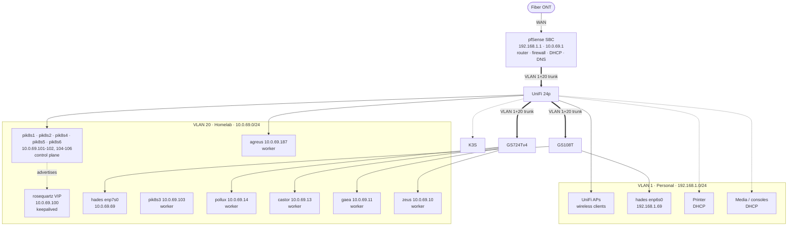

# NETWORK.md

Physical and layer-2 topology behind the static IPs configured in `machines/*/configuration.nix` and `clan/rosequartz-cluster.nix`.

## Overview

The network is split into two VLANs on a shared physical switch fabric.
VLAN 1 is the native, untagged personal network on `192.168.1.0/24`, carrying the workstation, wireless clients, and consumer devices.
VLAN 20 is the homelab network on `10.0.69.0/24`, isolated at layer 2, carrying the rosequartz Kubernetes cluster.

A pfSense SBC is the single edge device.
It terminates the fiber ONT, routes between the two VLANs, firewalls the boundary between them, and serves DHCP.
Every switch below it is layer 2 only.

## Topology

Solid links are confirmed physical attachments.
A dashed link to a switch marks an unverified attachment, detailed under [Known gaps](#known-gaps).
The dashed VIP link is a keepalived advertisement rather than a cable.

## VLANs and subnets

| VLAN | Name | Subnet | Gateway | Purpose |
| --- | --- | --- | --- | --- |
| 1 (native) | Personal | `192.168.1.0/24` | `192.168.1.1` | Workstation, wireless, consumer devices |
| 20 | Homelab | `10.0.69.0/24` | `10.0.69.1` | rosequartz Kubernetes cluster |

Neither subnet overlaps the cluster's internal ranges.
The rosequartz service CIDR is `10.0.0.0/24` and the pod CIDR is `10.244.0.0/16`.

## Hosts

| Host | IP | VLAN | Switch | Port | Role |
| --- | --- | --- | --- | --- | --- |
| hades (`enp6s0`) | `192.168.1.69` | 1 | GS108T | Unverified | Workstation |
| hades (`enp7s0`) | `10.0.69.69` | 20 | GS108T | Unverified | Workstation |
| zeus | `10.0.69.10` | 20 | GS724Tv4 | `g18` | rosequartz worker |
| gaea | `10.0.69.11` | 20 | GS724Tv4 | `g1` | rosequartz worker |
| pik8s1 | `10.0.69.101` | 20 | Unverified | Unverified | rosequartz control plane |
| pik8s2 | `10.0.69.102` | 20 | Unverified | Unverified | rosequartz control plane |
| pik8s3 | `10.0.69.103` | 20 | Unverified | Unverified | rosequartz worker |
| pik8s4 | `10.0.69.104` | 20 | UniFi 24p | Unverified | rosequartz control plane |
| pik8s5 | `10.0.69.105` | 20 | UniFi 24p | Unverified | rosequartz control plane |
| pik8s6 | `10.0.69.106` | 20 | UniFi 24p | Unverified | rosequartz control plane |
| agreus | `10.0.69.187` | 20 | UniFi 24p | Unverified | rosequartz worker |
| pollux | `10.0.69.14` | 20 | GS724Tv4 | `g7` | rosequartz worker |
| castor (`eno1`) | `10.0.69.13` | 20 | GS724Tv4 | `g5` | rosequartz worker |
| castor (`enp2s0`) | DHCP | 1 | GS724Tv4 | `g11` | Second NIC, unused by any config |
| rosequartz VIP | `10.0.69.100` | 20 | keepalived on pik8s1, pik8s2, pik8s4-6 | n/a | apiserver endpoint |
| Unidentified (`d0:50:99:e1:dc:92`) | `192.168.1.9` | 1 | GS724Tv4 | `g22` | Answers SSH with `ssh-rsa`/`ssh-dss` host keys only |
| Unidentified (`d0:50:99:e1:dd:1e`) | `192.168.1.7` | 1 | GS724Tv4 | `g24` | Answers SSH with `ssh-rsa`/`ssh-dss` host keys only |
| Printer | DHCP | 1 | Unverified | Unverified | Consumer |
| Media / consoles | DHCP | 1 | Unverified | Unverified | Consumer |

gaea, pollux, and castor each have a second NIC on the GS724Tv4 that no config uses: gaea on `g3` and castor on `g11`, both on VLAN 1, and pollux on `g9`, which carries PVID 20 and is up with a link-local address only (`fe80::20b:abff:fe71:dae3`).
zeus's other five NICs are all down and hold no address.
`g19` is the trunk uplink to the UniFi 24p.

hades holds two static addresses because `enp6s0` and `enp7s0` share a MAC address, which makes DHCP unreliable on both.
NetworkManager leaves both wired interfaces unmanaged and handles only `wlp5s0`.

## Switches

| Switch | Uplink | Carries | Downstream |
| --- | --- | --- | --- |
| UniFi 24p | pfSense, trunk | VLAN 1 + 20 | GS108T trunk, GS724Tv4 trunk, UniFi APs, pik8s4-6, agreus |
| GS108T | UniFi 24p, trunk | VLAN 1 + 20 | hades `enp6s0` on VLAN 1, hades `enp7s0` on VLAN 20 |
| GS724Tv4 | UniFi 24p on `g19`, trunk | VLAN 1 + 20 | zeus `g18`, gaea `g1`, pollux `g7`, and castor `g5` on VLAN 20 access ports |

Both Netgear switches answer SNMP v2c on community `public`: GS724Tv4 at `192.168.1.6`, GS108T at `192.168.1.5`.
Walking `dot1qTpFdbPort` (`1.3.6.1.2.1.17.7.1.2.2.1.2`) maps VLAN plus MAC to port number, and `dot1qPvid` (`1.3.6.1.2.1.17.7.1.4.5.1.1`) gives each port's untagged VLAN.
That pair is how the port assignments above were established, and is faster than the web UI for re-checking them.

The UniFi APs sit on VLAN 1 access ports, so wireless clients land on `192.168.1.0/24` with no path onto VLAN 20.
The UniFi controller itself runs on hades via `modules/unifi`, started on demand rather than at boot.

## DNS and service addressing

pfSense resolves LAN names for both VLANs.
Every machine points its `nameservers` at its own gateway: `192.168.1.1` on VLAN 1, `10.0.69.1` on VLAN 20.

CoreDNS runs inside rosequartz and resolves cluster-internal names.
It is reached through the cluster, not through the LAN resolver.

The apiserver is fronted by a keepalived VIP at `10.0.69.100`, held by whichever control-plane node has the highest priority and is healthy.

| Node | keepalived priority |
| --- | --- |
| pik8s4 | 100 |
| pik8s5 | 90 |
| pik8s6 | 80 |
| pik8s1 | 70 |
| pik8s2 | 60 |

pik8s4 holds the VIP by default.
The VIP is intentionally absent from the `hosts` flake, since it is not a machine.

## Known gaps

**hades reaches VLAN 20 on-link only.**
Its sole default gateway is `192.168.1.1` via `enp6s0`.
`10.0.69.0/24` is reachable as a directly connected subnet through `enp7s0`, not by routing through pfSense.
Any VLAN 20 address outside that `/24` is unreachable from hades.

**Switch attachment for pik8s1-3, the printer, and media devices is unverified.**
The printer and media devices are confirmed on VLAN 1 by their addresses; pik8s1-3 are configured for VLAN 20 and need their ports moved to match. Which switch port each occupies is not recorded.
