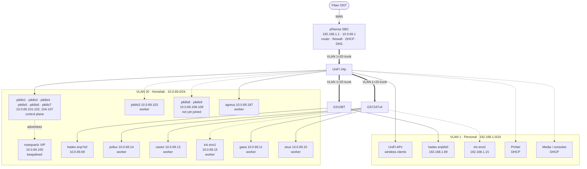

# NETWORK.md

Physical and layer-2 topology behind the static IPs configured in `machines/*/configuration.nix` and `clan/rosequartz-cluster.nix`.

## Overview

The network is split into two VLANs on a shared physical switch fabric.
VLAN 1 is the native, untagged personal network on `192.168.1.0/24`, carrying the workstation, wireless clients, and consumer devices.
VLAN 20 is the homelab network on `10.0.69.0/24`, isolated at layer 2, carrying the rosequartz Kubernetes cluster.

A pfSense SBC is the single edge device.
It terminates the fiber ONT, routes between the two VLANs, firewalls the boundary between them, and serves DHCP.
Every switch below it is layer 2 only.

## Topology

```mermaid
flowchart TB
  ONT(["Fiber ONT"])
  FW["pfSense SBC<br/>192.168.1.1 · 10.0.69.1<br/>router · firewall · DHCP · DNS"]

  ONT -->|WAN| FW

  U24["UniFi 24p"]
  GS108["GS108T"]
  GS724["GS724Tv4"]

  FW ==>|"VLAN 1+20 trunk"| U24
  U24 ==>|"VLAN 1+20 trunk"| GS108
  U24 ==>|"VLAN 1+20 trunk"| GS724

  subgraph V1["VLAN 1 · Personal · 192.168.1.0/24"]
    direction TB
    AP["UniFi APs<br/>wireless clients"]
    HADES1["hades enp6s0<br/>192.168.1.69"]
    IRIS1["iris eno2<br/>192.168.1.15"]
    PRN["Printer<br/>DHCP"]
    MED["Media / consoles<br/>DHCP"]
  end

  subgraph V20["VLAN 20 · Homelab · 10.0.69.0/24"]
    direction TB
    VIP["rosequartz VIP<br/>10.0.69.100<br/>keepalived"]
    HADES2["hades enp7s0<br/>10.0.69.69"]
    CP["pik8s1 · pik8s2 · pik8s4 · pik8s5 · pik8s6 · pik8s7<br/>10.0.69.101-102, 104-107<br/>control plane"]
    PIW["pik8s3 10.0.69.103<br/>worker"]
    NEWPI["pik8s8 · pik8s9<br/>10.0.69.108-109<br/>not yet joined"]
    AGREUS["agreus 10.0.69.187<br/>worker"]
    POLLUX["pollux 10.0.69.14<br/>worker"]
    CASTOR["castor 10.0.69.13<br/>worker"]
    IRIS["iris eno1<br/>10.0.69.15<br/>worker"]
    GAEA["gaea 10.0.69.11<br/>worker"]
    ZEUS["zeus 10.0.69.10<br/>worker"]
  end

  U24 --> AP
  U24 --> CP
  U24 --> AGREUS
  GS108 --> HADES1
  GS108 --> HADES2
  GS724 --> ZEUS
  GS724 --> GAEA
  GS724 --> CASTOR
  U24 -.-> PIW
  U24 -.-> NEWPI
  U24 -.-> PRN
  U24 -.-> MED
  GS724 --> POLLUX
  GS724 -.-> IRIS
  GS724 -.-> IRIS1

  CP -.->|advertises| VIP
```

Solid links are confirmed physical attachments.
A dashed link to a switch marks an unverified attachment, detailed under [Known gaps](#known-gaps).
The dashed VIP link is a keepalived advertisement rather than a cable.

## VLANs and subnets

| VLAN | Name | Subnet | Gateway | Purpose |
| --- | --- | --- | --- | --- |
| 1 (native) | Personal | `192.168.1.0/24` | `192.168.1.1` | Workstation, wireless, consumer devices |
| 20 | Homelab | `10.0.69.0/24` | `10.0.69.1` | rosequartz Kubernetes cluster |

Neither subnet, nor the untagged Ceph cluster network `10.0.70.0/24`, overlaps the cluster's internal ranges.
The rosequartz service CIDR is `10.0.0.0/24` and the pod CIDR is `10.1.0.0/16`, per the kube-apiserver and kube-controller-manager flags on the control-plane nodes.

## Hosts

| Host | IP | VLAN | Switch | Port | Role |
| --- | --- | --- | --- | --- | --- |
| hades (`enp6s0`) | `192.168.1.69` | 1 | GS108T | Unverified | Workstation |
| hades (`enp7s0`) | `10.0.69.69` | 20 | GS108T | Unverified | Workstation |
| zeus | `10.0.69.10` | 20 | GS724Tv4 | `g18` | rosequartz worker |
| gaea | `10.0.69.11` | 20 | GS724Tv4 | `g1` | rosequartz worker |
| apollo | `10.0.69.12` | 20 | GS724Tv4 | `g10` | rosequartz worker |
| pik8s1 | `10.0.69.101` | 20 | UniFi 24p | `22` | rosequartz control plane |
| pik8s2 | `10.0.69.102` | 20 | UniFi 24p | `20` | rosequartz control plane |
| pik8s3 | `10.0.69.103` | 20 | UniFi 24p | Unverified | rosequartz worker; web kiosk on its display |
| pik8s4 | `10.0.69.104` | 20 | UniFi 24p | `2` | rosequartz control plane |
| pik8s5 | `10.0.69.105` | 20 | UniFi 24p | `4` | rosequartz control plane |
| pik8s6 | `10.0.69.106` | 20 | UniFi 24p | `6` | rosequartz control plane |
| pik8s7 | `10.0.69.107` | 20 | UniFi 24p | Unverified | rosequartz control plane |
| pik8s8 | `10.0.69.108` | 20 | UniFi 24p | Unverified | Not yet in rosequartz; destined for its control plane |
| pik8s9 | `10.0.69.109` | 20 | UniFi 24p | Unverified | Not yet in rosequartz; destined for its control plane |
| agreus | `10.0.69.187` | 20 | UniFi 24p | `9` | rosequartz worker |
| pollux | `10.0.69.14` | 20 | GS724Tv4 | `g7` | rosequartz worker |
| iris (`eno1`) | `10.0.69.15` | 20 | Unverified | Unverified | rosequartz worker; not yet cabled |
| iris (`eno2`) | `192.168.1.15` | 1 | Unverified | Unverified | On-link only, no gateway; firewalled to iris's own traffic |
| castor (`eno1`) | `10.0.69.13` | 20 | GS724Tv4 | `g5` | rosequartz worker |
| castor (`enp2s0`) | DHCP | 1 | GS724Tv4 | `g11` | Second NIC, unused by any config |
| Samsung TV (UN50KU630D) | `192.168.1.75` | 1 | Wireless | n/a | agreus's HDMI display; agreus polls `:8001/api/v2/` to detect power, which needs a pfSense pass rule from `10.0.69.187` to `192.168.1.75:8001` |
| rosequartz VIP | `10.0.69.100` | 20 | keepalived on pik8s1-2, pik8s4-6 | n/a | apiserver endpoint |
| Unidentified (`d0:50:99:e1:dc:92`) | `192.168.1.9` | 1 | GS724Tv4 | `g22` | Answers SSH with `ssh-rsa`/`ssh-dss` host keys only |
| Unidentified (`d0:50:99:e1:dd:1e`) | `192.168.1.7` | 1 | GS724Tv4 | `g24` | Answers SSH with `ssh-rsa`/`ssh-dss` host keys only |
| Printer | DHCP | 1 | Unverified | Unverified | Consumer |
| Media / consoles | DHCP | 1 | Unverified | Unverified | Consumer |

gaea, pollux, and castor each have a second NIC on the GS724Tv4 that no config uses: gaea on `g3` and castor on `g11`, both on VLAN 1, and pollux on `g9`, which carries PVID 20 and is up with a link-local address only (`fe80::20b:abff:fe71:dae3`).
zeus's SFP+ card is `enp3s0f0` and `enp3s0f1`, with `enp3s0f1` on the [Ceph cluster network](#ceph-cluster-network).
Its other three NICs, `enp7s0`, `enp11s0`, and `enp12s0`, are down and hold no address.
`g19` is the trunk uplink to the UniFi 24p.

apollo's second onboard NIC (`40:b0:76:d7:f6:07`) is cabled to the GS724Tv4 but held down by `linkConfig.ActivationPolicy`, so it emits no frames and no port ever learns its address.
Its port is therefore not identifiable from the switch and is not recorded here.
Leave whichever port it occupies on VLAN 1: the interface is down precisely because a second default route breaks the strict reverse-path filter, and a VLAN 20 access port there would re-create that hazard if the interface ever came up.

hades holds two static addresses because `enp6s0` and `enp7s0` share a MAC address, which makes DHCP unreliable on both.
NetworkManager leaves both wired interfaces unmanaged and handles only `wlp5s0`.

iris is dual-homed the other way round from hades: its default route is `10.0.69.1` on `eno1`, and `eno2` holds `192.168.1.15` on-link with no gateway.
VLAN 1 clients should use `192.168.1.15` and VLAN 20 clients `10.0.69.15`.
A VLAN 1 client connecting to `10.0.69.15` goes out through pfSense but gets its replies straight from `eno2`, an asymmetric path that pfSense's state tracking can break.
Mangle rules drop anything on `eno2` not to or from `192.168.1.15`, so iris, which forwards for Kubernetes, never routes between the VLANs around pfSense.
Pod traffic for `192.168.1.0/24` takes a policy route through `10.0.69.1` instead of `eno2`.

## Switches

| Switch | Uplink | Carries | Downstream |
| --- | --- | --- | --- |
| UniFi 24p | pfSense, trunk | VLAN 1 + 20 | GS108T trunk, GS724Tv4 trunk, UniFi APs, pik8s1-9, agreus |
| GS108T | UniFi 24p, trunk | VLAN 1 + 20 | hades `enp6s0` on VLAN 1, hades `enp7s0` on VLAN 20 |
| GS724Tv4 | UniFi 24p on `g19`, trunk | VLAN 1 + 20 | zeus `g18`, gaea `g1`, apollo `g10`, pollux `g7`, and castor `g5` on VLAN 20 access ports |

Both Netgear switches answer SNMP v2c on community `public`: GS724Tv4 at `192.168.1.6`, GS108T at `192.168.1.5`.
Walking `dot1qTpFdbPort` (`1.3.6.1.2.1.17.7.1.2.2.1.2`) maps VLAN plus MAC to port number, and `dot1qPvid` (`1.3.6.1.2.1.17.7.1.4.5.1.1`) gives each port's untagged VLAN.
That pair is how the port assignments above were established, and is faster than the web UI for re-checking them.

The UniFi APs sit on VLAN 1 access ports, so wireless clients land on `192.168.1.0/24` with no path onto VLAN 20.
The UniFi controller itself runs on hades via `modules/unifi`, started on demand rather than at boot.

## Ceph cluster network

`10.0.70.0/24` is Ceph's cluster network, carrying OSD replication, recovery, and heartbeats among gaea, zeus, and apollo.
It runs on a UniFi SFP+ aggregator with no uplink to any other switch, so it has no gateway, no VLAN tag, and no route to or from the rest of the network.
The aggregator must have jumbo frames enabled, since every port and interface on it uses MTU 9000.

| Host | SFP+ port | Host address (`ceph0`) | OSD pod range |
| --- | --- | --- | --- |
| zeus | `enp3s0f1` | `10.0.70.10` | `10.0.70.64`-`10.0.70.95` |
| gaea | Card not installed | `10.0.70.11` | `10.0.70.96`-`10.0.70.127` |
| apollo | Card not installed | `10.0.70.12` | `10.0.70.128`-`10.0.70.159` |

`modules/ceph-cluster-network` puts the host address on `ceph0`, a macvlan shim on the SFP+ port, and runs multus as the host CNI plugin so OSD pods get a macvlan interface in the host's range.
The Rook side, and why the host address sits on a shim rather than the port, is in the-cluster's `docs/storage.md`.

## DNS and service addressing

Every machine points its `nameservers` at `10.0.69.201` and `10.0.69.202`, set once in `modules/dns` and imported by each `machines/*/configuration.nix`.
Both are full recursors, and they are the only resolvers that carry the `thecluster.lan` zone.
The pfSense gateways (`192.168.1.1` on VLAN 1, `10.0.69.1` on VLAN 20) resolve public names and the rest of the LAN, but answer NXDOMAIN inside `thecluster.lan`, so a machine pointed at its gateway cannot reach the `ncps.thecluster.lan` substituter in `modules/cache`.

The resolvers sit on VLAN 20, on-link for every machine there and reachable over `enp7s0` from hades.
Both are the pihole deployment in rosequartz (the-cluster `apps/pihole/rosequartz`), exposed on two load-balancer addresses, so they are one failure domain.
Each machine's default gateway is a second resolver for public names, set by `modules/dns` on the interface named in `networking.defaultGateway`.
It sits in that link's systemd-resolved scope rather than the global one, so it never answers for `thecluster.lan` (see below).
With both piholes down, public names still resolve, which the cluster nodes need to pull the pihole image that brings DNS back (the-cluster#4458).
The cost is that a public lookup the gateway answers first bypasses pihole blocking.

Every machine resolves through systemd-resolved and configures its wired interfaces with networkd, both from clan-core's recommended defaults.
The piholes are systemd-resolved's global scope, and anything a link supplies is scoped to that link: the gateway on every machine, plus NetworkManager's DHCP resolvers on hades' `wlp5s0`.
`modules/dns` sets the routing-only domain `~thecluster.lan` on the global scope, so internal names go to the piholes alone.
Every other name goes to the global scope and each default-route link in parallel, and the first answer wins.
Adding the gateway to the global scope instead would break `thecluster.lan`: resolved stays on whichever server in a scope last answered, so after an outage a machine would keep asking the gateway and get NXDOMAIN.

CoreDNS runs inside rosequartz and resolves cluster-internal names.
It is reached through the cluster, not through the LAN resolver.

The apiserver is fronted by a keepalived VIP at `10.0.69.100`, held by whichever control-plane node has the highest priority and is healthy.

| Node | keepalived priority |
| --- | --- |
| pik8s4 | 100 |
| pik8s5 | 90 |
| pik8s6 | 80 |
| pik8s1 | 70 |
| pik8s2 | 60 |
| pik8s7 | 50 |

pik8s4 holds the VIP by default.
Every control-plane machine runs keepalived on `end0`, which carries VLAN 20 untagged on all six.
The VIP is intentionally absent from the `hosts` flake, since it is not a machine.

## Known gaps

**hades reaches VLAN 20 on-link only.**
Its sole default gateway is `192.168.1.1` via `enp6s0`.
`10.0.69.0/24` is reachable as a directly connected subnet through `enp7s0`, not by routing through pfSense.
Any VLAN 20 address outside that `/24` is unreachable from hades.

**pik8s3's UniFi 24p port is unknown.**
It appears in no FDB and the controller's port table learns no MAC for it, so it is either powered off or uncabled.
The other UniFi 24p port numbers come from the controller's own `port_table`, read out of its MongoDB rather than by SNMP, since those ports are controller-managed.

**Switch attachment for the printer and media devices is unverified.**
They are confirmed on VLAN 1 by their addresses, but which switch port each occupies is not recorded.
